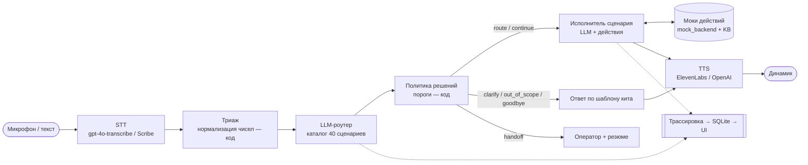

# Voice Router

**Голосовой AI-робот контакт-центра, в котором сценарий разговора выбирает LLM, а не классификатор намерений.**

HackAlem AI · трек Halyk Bank · кейс 2 «Voice Router» · команда Sever

🔗 **Демо:** https://voice-router-production.up.railway.app — экран клиента, `/supervisor` — панель супервизора.
Версия на Railway обновляется вручную (`railway up`) и может отставать от ветки `main`.

---

## 1. О проекте

Голосовые роботы в контакт-центрах хорошо говорят и слышат, но сценарий разговора у большинства выбирает классификатор, обученный на фиксированных формулировках. Он ломается на живой речи: клиент меняет тему посреди разговора, просит две вещи сразу, говорит на стыке двух сценариев или переходит с русского на казахский внутри фразы. Каждый неверный выбор — это перевод на оператора или потерянный клиент.

Voice Router — голосовой робот контакт-центра вымышленной страховой компании **Saqta Insurance** (данные из стартового кита хакатона). Клиент говорит своими словами по-русски, по-казахски или смешивая языки. Робот:

- понимает запрос с первой реплики и выбирает один из 40 сценариев **LLM-слоем**, который читает описания сценариев и правила их разграничения в контексте диалога;
- доводит сценарий до конца **на данных**: находит клиента по телефону, считает цены по формулам, проверяет платежи и заявления, оформляет полисы — необратимые действия только после явного «да»;
- отвечает голосом, а **супервизор** видит по каждой реплике: какой сценарий выбран, почему, какие были альтернативы, какие действия вызваны и сколько заняли этапы.

Для кого: **клиенты** контакт-центра, которые говорят своими словами, и **супервизоры**, которым нужно видеть, где робот сомневался и ошибся.

---

## 2. Что реализовано

**Разговор**
- Голос через микрофон в браузере и текст как резервный канал. Ответ в том же канале: спросили голосом — бот отвечает голосом, написали текстом — отвечает только текстом.
- Русский, казахский и смешанная речь внутри одной фразы; ответ на языке клиента.
- Выбор сценария LLM из каталога 40 сценариев + системные `SYS_UNCLEAR`, `SYS_OUT_OF_SCOPE`, `SYS_GOODBYE`.
- Несколько просьб в одной реплике: срочная первой, остальные — в стек тем, робот возвращается к ним после текущей.
- Смена темы посреди разговора с сохранением прерванной темы.
- Переспрос вместо угадывания при низкой уверенности; после двух неуверенных ответов подряд — передача оператору с резюме разговора.
- Гибридный каскад роутера: быстрый путь на NVIDIA API (OpenAI-совместимый, модель `NVIDIA_MODEL`) и эскалация на OpenAI, если уверенность ниже `FAST_CONFIDENCE_THRESHOLD` (0.85), речь смешанная, в реплике несколько тем или запрос неясен. Включается ключом `NVIDIA_API_KEY`; без ключа роутер сразу идёт в OpenAI.

**Ведение сценария на данных**
- Моки всех 31 действия из `actions.json` поверх `mock_backend.json` и формул `knowledge_base.json`: поиск клиента и полисов, расчёт ОГПО / КАСКО / путешествий / имущества / НС, проверка платежа, статус заявления, запись к врачу и на осмотр, расторжение с возвратом, жалобы, мошенничество, передача оператору.
- Суммы и номера считает код, модель их только озвучивает.
- Необратимые действия (оформление, продление, изменение, расторжение полиса, заявление, запись, смена контактов): сначала `preview` с озвучиванием данных, выполнение — только после явного подтверждения, строго с аргументами из `preview`. Проверка в коде, а не в промпте.
- Нормализация продиктованных чисел кодом (ru/kk): «плюс жеті, жеті жүз бір, нөл нөл нөл, нөл нөл, он» → `+77010000010`; ИИН, номера полиса и заявления, госномер; относительные даты («вчера», «үш күн бұрын»).

**Интерфейс**
- Экран клиента: голосовой шар (WebGL), запись, текст, потоковое воспроизведение ответа, выключение звука, новый диалог.
- Трассировка под каждым ответом: сценарии с уверенностью, альтернативы, обоснование, решение политики, слоты, клиент, действия (`preview` / `execute` / защита / ошибка), отложенные темы, время по этапам.
- Панель супервизора: метрики (реплики, доля передач оператору, p50 роутера и до звука), живая лента трассировок, поиск, карточка реплики, популярные сценарии.

**Инфраструктура**
- Запуск одной командой (`docker compose up`), деплой на Railway.
- Переключаемые провайдеры STT/TTS и запасные варианты: демо не замолкает, если один API недоступен.
- Скрипты проверки: точность на dev-наборе, прогон эталонных диалогов, репетиция в формате жюри, смоук-тест API.

---

## 3. Как работает — путь одной реплики

Пример из ТЗ: *«Здравствуйте, я вчера оплатил, деньги списались, а полиса нет»*.

1. **Микрофон → STT.** Браузер записывает реплику и отправляет аудио по WebSocket. Сервер распознаёт речь (`gpt-4o-transcribe` с подсказкой «только русский или казахский»; запасной — ElevenLabs Scribe). Если текст почти без кириллицы — распознаёт повторно другим провайдером.
2. **Триаж (код).** Числа, телефоны, ИИН, номера полисов и относительные даты приводятся к нормальному виду: «вчера» → `2026-09-30` (дата «сегодня» по киту — 2026-10-01).
3. **LLM-роутер.** Модель получает весь каталог сценариев, историю диалога и реплику и возвращает JSON: `SC30` (деньги списаны, полис не выпущен) с уверенностью, альтернативы, язык, слоты (`payment_date`). Решение читается из потока, как только модель его дописала.
4. **Политика (код).** Уверенность ≥ 0.75 — запуск сценария; 0.45–0.75 — переспрос с двумя вариантами; ниже 0.45 два раза подряд — оператор.
5. **Исполнитель сценария.** LLM с инструментами — только действиями этого сценария. Спрашивает телефон, находит клиента (`find_client`), проверяет платёж (`check_payment`: 31 200 ₸, полис не выпущен) и по правилу сценария передаёт разговор специалисту (`transfer_to_operator`). Пока идут действия, клиент уже слышит «Сейчас проверю».
6. **TTS → динамик.** Если реплика была голосовой, каждое готовое предложение ответа сразу озвучивается (ElevenLabs, запасной — OpenAI TTS) и играет в браузере потоком.
7. **Трассировка.** Решение, действия и время этапов пишутся в SQLite и сразу появляются под ответом и в панели супервизора.

---

## 4. Технологии

| Слой | Что используется |
|---|---|
| Бэкенд | Python 3.12, FastAPI, Uvicorn, Pydantic / pydantic-settings, httpx, NumPy, SQLite |
| Фронтенд | React 19, TypeScript, Vite 6, Tailwind CSS 4, shadcn/ui, lucide-react, ogl (WebGL-шар); запасные страницы — HTML/JS без сборки в `static/` |
| LLM | OpenAI `gpt-4.1-mini` — роутер (`OPENAI_MODEL`), `gpt-4.1` — исполнитель сценария (`EXECUTOR_MODEL`) |
| STT | OpenAI `gpt-4o-transcribe` (основной), ElevenLabs Scribe `scribe_v2` с `language_code=kaz` (запасной) |
| TTS | ElevenLabs `eleven_flash_v2_5` со стримом (основной), OpenAI `tts-1` (запасной), браузерный `speechSynthesis` |
| Опционально | NVIDIA API (OpenAI-совместимый, `meta/llama-3.1-8b-instruct` по умолчанию) — быстрый путь каскада роутера, включается `NVIDIA_API_KEY`; OpenAI `text-embedding-3-small` — сужение кандидатов (`TOP_K_CANDIDATES`). Оба выключены по умолчанию |
| Инфраструктура | Docker (многостадийная сборка: Node 22 → Python 3.12), docker compose, Railway |

---

## 5. Архитектура



| Компонент | Файл | Роль |
|---|---|---|
| API и WebSocket | `app/main.py` | страницы, `/ws/session` (голос и текст), `/ws/supervisor`, REST, конвейер озвучки по предложениям |
| Оркестратор | `app/orchestrator.py` | состояние разговора: история, клиент, активный сценарий, стек тем, слоты, озвученные `preview`; параллельный запуск исполнителя с роутером на репликах-продолжениях |
| Триаж | `app/normalize.py` | числа ru/kk → цифры, телефон, ИИН, полис, заявление, госномер, относительные даты |
| LLM-роутер | `app/router/llm_router.py` | промпт из каталога (`description`, `not_this_if`, слоты, примеры), потоковый разбор JSON |
| Каскад | `app/router/cascade.py` | быстрый путь (NVIDIA, опционально) → сильная модель (OpenAI) |
| Политика | `app/router/policy.py` | пороги уверенности, порядок сценариев, продолжение, переспрос, оператор |
| Исполнитель | `app/executor.py` | LLM с инструментами, защита необратимых действий, поток ответа по предложениям |
| Моки действий | `app/backend.py` | 31 действие, формулы цен и возвратов, ошибки в формате кита, `preview` на копии состояния |
| Системные ответы | `app/responder.py` | `SYS_*`, передача оператору |
| Провайдеры | `app/providers/` | OpenAI / NVIDIA, STT, TTS с запасными вариантами |
| Трассировка | `app/tracing.py` | замеры этапов, SQLite, статистика, трансляция супервизору |
| Интерфейс | `frontend/` (React), `static/` (запасной) | экран клиента и панель супервизора |

**Почему это не intent-классификатор.** Сценарий выбирает генеративная LLM по описаниям сценариев и правилам «НЕ этот сценарий, если …» в контексте диалога. Модель не обучалась на примерах и не сопоставляет реплики с метками; эмбеддинг-поиск по умолчанию выключен (`TOP_K_CANDIDATES=0`), а если включить — он только сокращает промпт, решение всё равно за LLM. Новый сценарий добавляется записью в `scenarios.json` без переобучения. Проверочные реплики не захардкожены.

---

## 6. Установка и запуск

Нужны ключ **OpenAI** (обязательно) и ключ **ElevenLabs** с правами Text to Speech и Speech to Text (желательно; без него работают запасные OpenAI STT/TTS).

### Docker — одной командой

```bash
git clone https://github.com/BAITC-Hacks/hack-dc2355c1-sever.git
cd hack-dc2355c1-sever
cp .env.example .env          # вписать OPENAI_API_KEY и ELEVENLABS_API_KEY
docker compose up --build
```

Откройте http://localhost:8000 (клиент) и http://localhost:8000/supervisor (супервизор). Микрофон работает на `localhost` и по HTTPS.

### Без Docker

```bash
python3 -m venv .venv
.venv/bin/pip install -r requirements.txt
cd frontend && npm ci && npm run build && cd ..   # сборка React-интерфейса в static/ui (нужен Node 22)
.venv/bin/uvicorn app.main:app --port 8000
```

Без сборки фронтенда сервер отдаёт запасные страницы из `static/`.

### Railway

Образ собирается из `Dockerfile`, порт — из `$PORT`, healthcheck — `/api/health` (`railway.toml`).

```bash
railway login
railway init        # или railway link к существующему проекту
railway up          # заливает текущую папку; .env не отправляется
railway domain      # HTTPS-домен — нужен браузеру для микрофона
```

Переменные из `.env` добавьте в Variables → Raw Editor (`PORT` не нужен).

### Основные переменные окружения

Полный список с комментариями — в `.env.example`.

| Переменная | По умолчанию | Назначение |
|---|---|---|
| `OPENAI_API_KEY` | — | роутер, исполнитель, STT, запасной TTS |
| `OPENAI_MODEL` / `EXECUTOR_MODEL` | `gpt-4.1-mini` / `gpt-4.1` | модели роутера и исполнителя |
| `ELEVENLABS_API_KEY` | — | TTS и запасной STT |
| `STT_PROVIDER` / `TTS_PROVIDER` | `openai` / `elevenlabs` | основной провайдер распознавания и озвучки |
| `ROUTE_THRESHOLD` / `CLARIFY_THRESHOLD` | `0.75` / `0.45` | пороги политики решений |
| `SPECULATIVE_EXECUTOR` | `true` | исполнитель параллельно с роутером на репликах-продолжениях |
| `NVIDIA_API_KEY` | — | опциональный быстрый путь роутера |

---

## 7. Как проверить решение

### Сценарий для жюри (5 минут)

Откройте экран клиента и рядом `/supervisor`. Говорите в микрофон или пишите текстом.

1. **Клиент из базы, запрос из ТЗ.** «Здравствуйте, я вчера оплатил полис, деньги списались, а полиса нет» → бот просит телефон → «Плюс семь семьсот один ноль ноль ноль ноль ноль ноль три». Ожидается: бот находит клиента, видит платёж 31 200 ₸ без выпущенного полиса и передаёт разговор специалисту. В трассировке — `SC30`, действия `find_client`, `check_payment`, `transfer_to_operator`.
2. **Казахский и данные клиента.** «Сәлеметсіз бе, полисім әлі жарамды ма?» → «Телефоным плюс жеті жеті жүз бір нөл нөл нөл нөл нөл нөл сегіз». Ожидается: ответ на казахском, полис SQ-OGPO-103990 действует до 14 февраля 2027.
3. **Две темы и стык сценариев.** «Выплату одобрили, но сумма почти вдвое меньше, чем посчитали на СТО» → `SC19` (несогласие с решением), а не `SC17` (статус).
4. **Необратимое действие.** «Көлігімді саттым, КАСКО шартын бұзғым келеді» → телефон `+7 701 000 00 10`. Ожидается: бот называет возврат 163 800 ₸ и спрашивает подтверждение; в трассировке `cancel_policy:preview`. Только после «Иә, растаймын» — `cancel_policy:execute`.
5. **Вне тематики и неясный запрос.** «Можно у вас взять кредит?» → вежливый отказ. «Мне по поводу машины» → переспрос с двумя вариантами.

### Полный список реплик — [`TEST_QUESTIONS.md`](TEST_QUESTIONS.md)

Реплики по группам с ожидаемыми сценариями и ответами: простые запросы, казахский, смешанная речь, две темы, стыки похожих сценариев, 7 разговоров с клиентами из `mock_backend.json` (с телефонами), необратимые действия, смена темы и возврат, вне тематики, оператор, ошибки. Там же — что смотреть в трассировке.

### Автоматические проверки

```bash
# Точность роутера на 104 размеченных репликах dev-набора → эталонный data/evaluate.py
.venv/bin/python -m scripts.eval_router --mode strong    # только OpenAI
.venv/bin/python -m scripts.eval_router --mode cascade   # NVIDIA → OpenAI (нужен NVIDIA_API_KEY)

# 10 размеченных диалогов из data/dialogs_sample.json через весь конвейер: сценарии и действия против эталона
.venv/bin/python -m scripts.run_dialogs

# 10 собственных реплик в формате проверки жюри (scripts/rehearsal_set.json)
.venv/bin/python -m scripts.rehearsal

# Смоук-тест API (28 проверок) на запущенном сервере — локальном или задеплоенном
.venv/bin/python -m scripts.smoke_api
.venv/bin/python -m scripts.smoke_api https://voice-router-production.up.railway.app
```

`eval_router`, `run_dialogs` и `rehearsal` вызывают OpenAI API (прогон `eval_router` — порядка $0.3–1).

### Результаты наших прогонов

| Проверка | Результат |
|---|---|
| dev-набор, 104 реплики (`eval_router`, `gpt-4.1-mini`) | основной сценарий **96.2 %**, полное совпадение **97.1 %**; казахский 97.8 %, смешанная речь 100 %, вне тематики 100 %, неясные 100 %; язык ответа 96 из 97 |
| эталонные диалоги (`run_dialogs`) | основной сценарий в **38 из 40** реплик; суммы и номера совпадают с эталоном (ОГПО 38 000 ₸, поездка 15 400 ₸, возврат 163 800 ₸, CL-500342) |
| репетиция (`rehearsal`) | **10 из 10** по основному сценарию, всем темам и языку ответа |
| смоук-тест API (`smoke_api`) | 28 из 28 локально |
| время до первого звука ответа (текстовый канал) | медиана 1.8–2.7 с в разных прогонах; реплики-продолжения быстрее (1.3–1.9 с) за счёт параллельного исполнителя |

Оставшиеся ошибки на dev-наборе — пограничные пары: «сломал ногу за границей» (SC15 / SC16), «какие бумаги, если затопили» (SC18 / SC14).

---

## 8. Данные и интеграции

**Данные — стартовый кит хакатона** (`data/`, синтетические; «сегодня» по киту — 2026-10-01):

| Файл | Содержимое | Где используется |
|---|---|---|
| `scenarios.json` | 40 сценариев + 3 системных намерения: описание, `not_this_if`, приоритет, слоты, действия, примеры ru/kk, стартовые реплики | промпт роутера, исполнитель, ответы |
| `slots.json` | 43 слота: тип, формат, вопросы ru/kk | вопросы клиенту, нормализация |
| `actions.json` | 31 действие, коды ошибок, очереди операторов | моки действий, инструменты исполнителя |
| `knowledge_base.json` | офисы, продукты и формулы цен, клиники, правила урегулирования, документы, возвраты | расчёты и ответы по фактам |
| `mock_backend.json` | 11 клиентов, 11 полисов, 4 заявления, 2 платежа | идентификация клиента и ответы по его данным |
| `dev_utterances.json`, `evaluate.py` | 104 размеченные реплики и эталонный скрипт оценки | `scripts/eval_router.py` |
| `dialogs_sample.json` | 10 размеченных диалогов | `scripts/run_dialogs.py` |

**Внешние API:**

| Сервис | Для чего | Обязателен |
|---|---|---|
| OpenAI API | роутер, исполнитель, STT `gpt-4o-transcribe`, запасной TTS | да |
| ElevenLabs API | TTS (стрим), запасной STT | нет — есть запасные варианты |
| NVIDIA API | быстрый путь роутера (каскад NVIDIA → OpenAI) | нет, включается `NVIDIA_API_KEY` |

**Интерфейсы приложения:**

| Метод | Путь | Назначение |
|---|---|---|
| WS | `/ws/session` | реплика голосом (бинарное аудио) или текстом `{"type":"text","text":"…"}` → `transcript`, `bot_partial`, mp3-чанки (только на голосовую реплику или с `"speak": true`), `trace`, `final` |
| WS | `/ws/supervisor` | трассировки всех сессий в реальном времени |
| POST | `/api/chat` | текстовая реплика `{text, session_id?}` → трассировка |
| GET | `/api/traces`, `/api/stats` | последние трассировки и статистика |
| GET / PUT | `/api/scenarios` | чтение и сохранение каталога сценариев |
| GET | `/api/sessions/{id}/handoff` | резюме разговора для оператора |
| GET | `/api/health` | какие провайдеры подключены |

---

## 9. Ограничения

- **Задержка.** Время до первого звука зависит от сети до OpenAI и в наших прогонах менялось от 1.8 до 2.7 с по текстовому каналу — выше ориентира ТЗ в 1.5 с. Голосом добавляется распознавание (0.7–1.9 с): аудио отправляется целиком после окончания реплики, распознавания во время речи нет. На новых темах роутер и исполнитель идут последовательно.
- **STT.** Качество распознавания казахской и смешанной речи определяет всё остальное. Проверяли на синтезированной речи и отдельных живых репликах; большой проверки живыми голосами не было.
- **Языки.** Только русский и казахский.
- **Данные.** Backend — моки на синтетических данных; изменения (оформленные полисы, расторжения) живут в памяти процесса и сбрасываются при перезапуске. Трассировки хранятся в SQLite внутри контейнера и на Railway пропадают при новом деплое.
- **Редактирование каталога.** `PUT /api/scenarios` сохраняет каталог, но роутер кэширует промпт — новые описания применяются после перезапуска сервера.
- **Доступ.** Авторизации нет: `/supervisor` и `PUT /api/scenarios` открыты всем, у кого есть ссылка.
- **Быстрый путь NVIDIA** реализован (`app/router/cascade.py`, `app/providers/llm.py`) и включается одной переменной `NVIDIA_API_KEY`; `scripts/eval_router.py --mode fast` и `--mode cascade` замеряют его точность и задержку. В демо он не включён: бесплатный endpoint `llama-3.1-8b-instruct` помечен deprecated, а маленькие открытые модели слабо понимают казахский, поэтому точность и выигрыш по задержке с NVIDIA мы не замеряли. Метрика «Быстрый маршрут» в панели супервизора без ключа показывает 0 %.
- **Браузеры.** Интерфейс проверялся в Chrome на desktop; Safari и iPhone отдельно не проверялись (для Safari есть запасное воспроизведение звука без MediaSource и определение формата записи mp4).
- **Перебивание только кнопкой.** Голосом перебить робота во время ответа нельзя: нажатие на микрофон останавливает озвучку и начинает новую запись.
- **Приватность.** Все данные синтетические; реальные персональные данные во внешние API не передаются.
