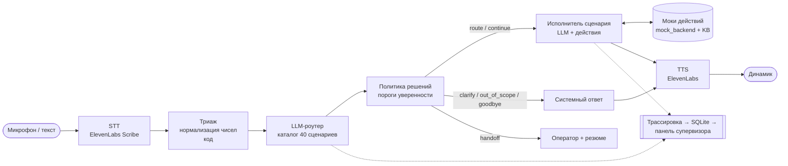

# Voice Router — голосовой AI-робот контакт-центра с LLM-слоем выбора сценария

HackAlem AI · трек Halyk Bank · кейс 2 «Voice Router». Команда Sever.

Голосовой робот контакт-центра страховой компании **Saqta Insurance** (вымышленная, данные из стартового кита).
Клиент говорит своими словами — по-русски, по-казахски или смешивая языки в одной фразе. Робот:

1. **понимает запрос и выбирает сценарий LLM-слоем** — без intent-классификатора;
2. **ведёт сценарий на данных**: идентифицирует клиента по телефону, считает цены по формулам, проверяет платежи, оформляет полисы и заявления — необратимые действия только после явного «да»;
3. **отвечает голосом** и показывает супервизору **трассировку**: выбранный сценарий, обоснование, альтернативы, вызванные действия, задержку по этапам.

Если робот не уверен — переспрашивает, а не угадывает. Если не справляется — передаёт оператору вместе с контекстом.

---

## Быстрый старт

Нужны ключи OpenAI (обязательно) и ElevenLabs (голос; без него работает браузерный синтез и Whisper).

```bash
cp .env.example .env        # вставить OPENAI_API_KEY и ELEVENLABS_API_KEY
docker compose up --build   # http://localhost:8000
```

- `http://localhost:8000` — экран клиента: кнопка микрофона, текст как резервный канал.
- `http://localhost:8000/supervisor` — панель супервизора: трассировка каждой реплики и статистика.

Без Docker:

```bash
python -m venv .venv && .venv/bin/pip install -r requirements.txt
.venv/bin/uvicorn app.main:app --port 8000
```

### Railway

Образ собирается из `Dockerfile`, порт берётся из `$PORT`, healthcheck — `/api/health` (`railway.toml`).
Без привязки GitHub:

```bash
railway login && railway init && railway up   # заливает текущую папку, .env не уходит
railway domain                                  # HTTPS-домен — нужен браузеру для микрофона
```

Переменные из `.env` добавить во вкладке Variables → Raw Editor (`PORT` не нужен).

### Проверка точности и диалогов

```bash
python -m scripts.eval_router --mode strong   # 104 реплики dev-набора → эталонный evaluate.py
python -m scripts.run_dialogs                 # 10 размеченных диалогов через весь конвейер
python -m scripts.rehearsal                   # 10 реплик в формате проверки жюри
python -m scripts.smoke_api [URL]             # смоук-тест API на запущенном сервере (по умолчанию localhost:8000)
```

---

## Архитектура



Состояние диалога (`app/orchestrator.py`): язык, найденный клиент, активный сценарий, стек отложенных тем, слоты, озвученные preview.

### 1. Триаж — `app/normalize.py`
Детерминированно, ~0 мс. Переводит продиктованные числа в цифры на русском и казахском и достаёт идентификаторы:
«плюс жеті, жеті жүз бір, нөл нөл нөл, нөл нөл, он» → `+77010000010`; также ИИН, номер полиса, заявления, госномер.
LLM здесь ненадёжна («жеті жүз бір» → 717), поэтому значения из кода перекрывают значения модели.

### 2. LLM-роутер — `app/router/llm_router.py`
- В system-промпте **весь каталог**: для каждого из 40 сценариев — описание, правила `not_this_if` («НЕ он, если … → SCxx»), слоты, по 2 примера на русском и казахском; плюс системные намерения `SYS_UNCLEAR`, `SYS_OUT_OF_SCOPE`, `SYS_GOODBYE`. Префикс статичный → кэшируется провайдером.
- В user-части — история диалога, активный сценарий, новая реплика и результат триажа.
- Ответ — компактный JSON в формате кита: сценарии в порядке упоминания с confidence, альтернативы, язык реплики и язык ответа, слоты, признак продолжения, обоснование.
- **Потоковое чтение**: решение идёт первым полем, его разбираем как только оно дописано; обоснование для супервизора догенерируется параллельно с ответом клиенту.

### 3. Политика решений — `app/router/policy.py`
Пороги из README стартового кита, в коде, а не в промпте:

| confidence | действие |
|---|---|
| ≥ 0.75 | запуск сценария |
| 0.45 – 0.75 | `SYS_UNCLEAR`: один вопрос с двумя вариантами |
| < 0.45 два раза подряд | передача оператору с контекстом |

Несколько сценариев: сначала `urgent`, остальные — в порядке упоминания, в стек тем. Продолжение активного сценария — без повторной маршрутизации.

### 4. Исполнитель сценария — `app/executor.py`
LLM (`gpt-4.1`) с вызовом инструментов. Доступны **только действия активного сценария** из `actions.json` + служебные (`find_client`, `get_policies`, `kb_lookup`, `transfer_to_operator`). Исполнитель идентифицирует клиента, по одному спрашивает недостающие слоты (формулировки из `slots.json`), вызывает действия и отвечает 1–2 фразами строго по их результатам.

**Безопасность — в коде:**
- необратимое действие (`create_policy`, `cancel_policy`, `create_claim`, …) можно выполнить (`execute`) только если на прошлой реплике клиенту был озвучен его `preview`; иначе вызов принудительно становится preview и модель получает `confirmation_required`;
- при `execute` используются **аргументы из preview** — выполняется ровно то, что клиент услышал и подтвердил;
- preview считается на копии состояния backend: до «да» ничего не меняется.

### 5. Моки действий — `app/backend.py`
Все 31 действие из `actions.json` поверх `mock_backend.json` и формул `knowledge_base.json`: ОГПО (регион × тип ТС × бонус-малус × срок), КАСКО, путешествия по зонам, имущество, НС, возврат при расторжении (полные неиспользованные месяцы × 0.9), записи к врачу, осмотры, заявления, споры. Ошибки — в формате кита (`not_found`, `policy_inactive`, …). **Суммы считает код** — модель не может их придумать.

Сверка с эталонными диалогами: ОГПО Алматы на двух водителей класса 3 — 38 000 ₸; поездка в Турцию на двоих 10–16 октября — 15 400 ₸; возврат по КАСКО SQ-CASCO-204350 — 163 800 ₸ — совпадают с `dialogs_sample.json`.

### 6. Голос — `app/providers/`
STT — ElevenLabs Scribe (fallback — OpenAI Whisper), TTS — ElevenLabs Flash со стримом (fallback — OpenAI TTS, затем браузерный `speechSynthesis`). Провайдеры переключаются через `.env` — демо не падает, если один API недоступен.

### Почему это не intent-классификатор
Сценарий выбирает генеративная LLM, читая описания и правила разграничения сценариев в контексте диалога — не модель, обученная сопоставлять реплики с метками. Нет обучения на примерах, нет эмбеддинг-поиска по умолчанию (`TOP_K_CANDIDATES=0`; опциональное сужение кандидатов эмбеддингами только сокращает промпт, решение всё равно за LLM). Новый сценарий добавляется записью в `scenarios.json` без переобучения. Хардкода проверочных реплик нет.

---

## Результаты

### Точность маршрутизации — dev-набор (104 реплики, эталонный `evaluate.py`)

`gpt-4.1-mini`, каждая реплика как первая в диалоге:

| группа | n | primary accuracy | full match |
|---|---|---|---|
| все | 104 | **0.962** | **0.971** |
| казахский | 45 | 0.978 | 0.978 |
| смешанная речь | 7 | 1.000 | 1.000 |
| русский | 52 | 0.942 | 0.962 |
| несколько намерений | 13 | 0.846 | 0.923 |
| вне тематики | 4 | 1.000 | 1.000 |
| неясные | 3 | 1.000 | 1.000 |

intent recall (multi-intent): 0.962 · язык ответа верный: 96/97.
Оставшиеся ошибки — пограничные пары (SC15/SC16 «сломал ногу за границей», SC18/SC14 «какие бумаги, если затопили»).

### Диалоги — `dialogs_sample.json` (10 диалогов, весь конвейер)
Основной сценарий верный в **38 из 40** реплик клиента; смена темы, возврат к теме, смешанная речь, переход с казахского на русский, переспрос, передача оператору и подтверждение необратимых действий отрабатывают; суммы и номера совпадают с эталоном.

### Задержка
Главная метрика ТЗ: от конца реплики клиента до начала звука ответа (`stages_ms.end_to_audio`).
Замер по WebSocket с ноутбука в Алматы до OpenAI и ElevenLabs, ответ со звуком ElevenLabs, два многоходовых диалога (ОГПО, расторжение КАСКО на казахском):

| | медиана |
|---|---|
| до первого звука, все реплики | **1.76 с** |
| до первого звука, продолжение темы (ответ на вопрос бота) | 1.3 – 1.9 с |
| до первого звука, новая тема | 2.1 – 2.3 с |
| до первого звука, системный ответ (вне тематики, прощание) | ~1.3 с |
| роутер до решения | ~1.0 с |

Как ускорено:
- **исполнитель параллельно с роутером**: большинство реплик — продолжение текущей темы, поэтому исполнитель стартует одновременно с роутером. Его текст и действия, меняющие данные, ждут решения роутера; если роутер выбрал другое — заготовка выбрасывается (`SPECULATIVE_EXECUTOR`);
- **поток роутера**: решение читается сразу, как только модель его дописала; обоснование догенерируется параллельно;
- **поток исполнителя**: ответ режется на предложения, каждое готовое предложение сразу уходит в TTS; браузер играет mp3 потоком (MediaSource);
- **без пауз при действиях**: пока выполняются действия (поиск клиента, проверка платежа), клиент уже слышит «Сейчас проверю»;
- **системные ответы без LLM**: прощание, «вне тематики», переспрос — по шаблонам кита сразу после роутера.

### Репетиция — `scripts/rehearsal.py`
10 собственных реплик в формате проверки жюри (не из dev-набора, `scripts/rehearsal_set.json`): простые на русском и казахском, смешанная речь со срочным случаем, две темы в одной фразе, стык сценариев, вне тематики, неясный запрос, смена темы посреди диалога, клиенты из `mock_backend` по телефону.
Результат: основной сценарий **10/10**, все темы 10/10, язык ответа 10/10; медиана до первого предложения ответа 1.8 с.

---

## Структура

```
app/
  main.py            FastAPI: страницы, WebSocket /ws/session и /ws/supervisor, REST /api/*
  orchestrator.py    сессия: история, клиент, активный сценарий, стек тем, слоты, preview
  normalize.py       триаж: числа из речи → цифры, идентификаторы
  router/            llm_router (промпт + разбор), cascade (быстрый/сильный путь), policy (пороги)
  executor.py        исполнитель сценария: LLM + инструменты, защита необратимых действий
  backend.py         моки действий поверх mock_backend + KB
  responder.py       системные ответы (SYS_*, оператор)
  providers/         llm (OpenAI/NVIDIA), stt, tts
  tracing.py         замеры этапов, SQLite, трансляция супервизору
static/              экран клиента и панель супервизора (HTML/JS без сборки)
data/                стартовый кит: scenarios, slots, actions, KB, mock_backend, dev, dialogs, evaluate.py
scripts/             eval_router.py, run_dialogs.py
```

### API
| метод | путь | назначение |
|---|---|---|
| WS | `/ws/session` | голос (бинарное аудио реплики) или `{"type":"text","text":...}` → `transcript`, `trace`, mp3-чанки, `final` |
| POST | `/api/chat` | текстовая реплика `{text, session_id?}` → трассировка |
| GET | `/api/stats`, `/api/traces` | статистика и последние трассировки |
| GET/PUT | `/api/scenarios` | каталог сценариев (редактирование без разработчика) |
| GET | `/api/sessions/{id}/handoff` | резюме для оператора |
| GET | `/api/health` | какие провайдеры подключены |

### Переменные окружения
См. `.env.example`. Основные: `OPENAI_API_KEY`, `OPENAI_MODEL` (роутер), `EXECUTOR_MODEL`, `ELEVENLABS_API_KEY`, `STT_PROVIDER`/`TTS_PROVIDER`, пороги `ROUTE_THRESHOLD`/`CLARIFY_THRESHOLD`, `NVIDIA_API_KEY` (опциональный быстрый путь).

---

## Границы применимости

- **Задержка.** Медиана до первого звука — 1.76 с; реплики-продолжения часто укладываются в 1.5 с, новые темы — нет: там роутер (~1 с) и исполнитель идут последовательно. Замер без STT: распознавание добавляет своё время. Дальше: realtime-STT со стримом, сервер ближе к API.
- **STT.** Качество распознавания казахской и смешанной речи определяет всё остальное; Whisper (fallback) заметно хуже Scribe на казахском.
- **Данные.** Backend — моки на синтетических данных; изменения живут в памяти процесса и сбрасываются при перезапуске.
- **Быстрый путь NVIDIA** реализован в каскаде, но выключен: бесплатный endpoint `llama-3.1-8b-instruct` помечен deprecated, а маленькие открытые модели слабо понимают казахский.
- **Приватность.** Все данные синтетические; внешним API (OpenAI, ElevenLabs) реальные персональные данные не передаются.
